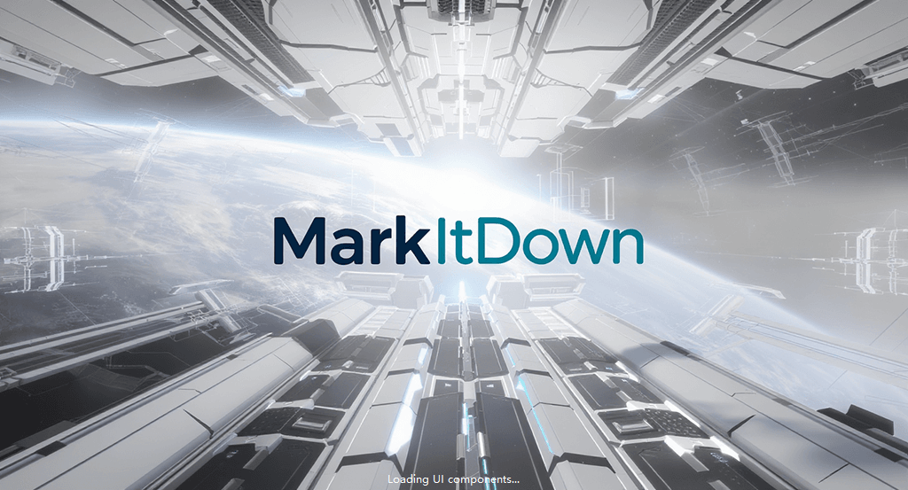
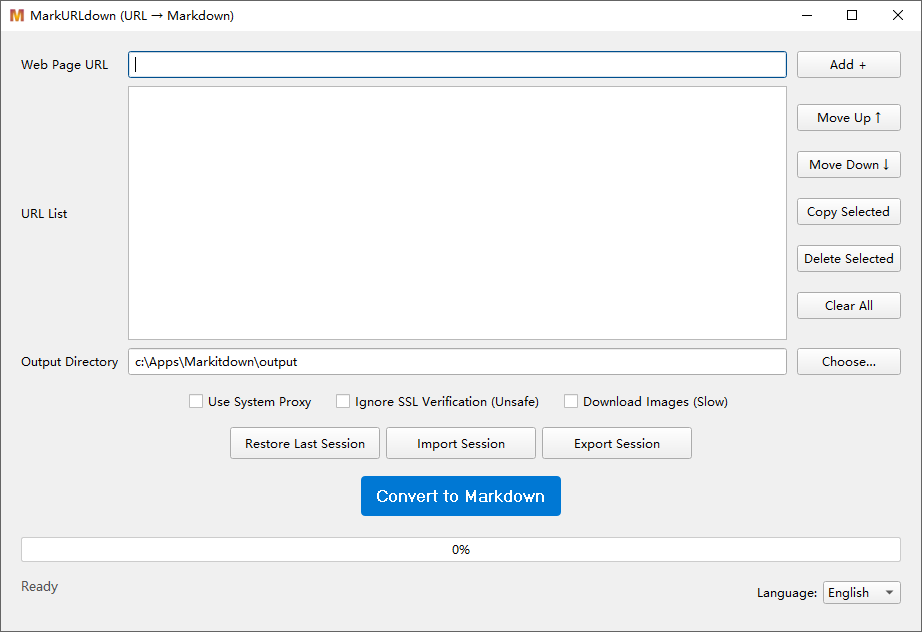

# MarkURLDown

MarkURLDown is a sophisticated desktop application designed to effortlessly convert web articles into clean, readable Markdown files. Built with a modular architecture and modern GUI framework, it's perfect for archiving content, creating a personal knowledge base.

## Screenshots





## Features

*   **Modern & Intuitive GUI:** A clean and responsive graphical interface built with PySide6.
*   **Batch Conversion:** Convert multiple URLs in a single session with progress tracking and real-time status updates.
*   **Advanced Crawler Technology:** Multi-strategy crawler system with automatic fallback:
    *   **Playwright:** Modern browser automation for complex anti-bot scenarios
    *   **httpx:** High-performance HTTP/2 client for fast requests
    *   **Requests:** Lightweight HTTP client for simple scenarios
    *   **Anti-Detection Measures:** Advanced browser automation with realistic user behavior simulation, geolocation spoofing, and stealth techniques
    *   **Dynamic Content Processing:** Handles JavaScript-rendered content, lazy-loaded images, and interactive elements
    *   **Smart Retry Logic:** Automatic retry with exponential backoff for failed requests and rate limiting
*   **Smart Content Extraction:** Intelligently cleans up clutter like ads, navigation bars, and footers to grab only the main article content.
*   **Specialized Site Handlers:** Dedicated processors for complex websites:
    *   **WeChat Official Account Articles:** Advanced handling with multi-strategy crawling and anti-detection measures
    *   **Zhihu.com:** Supports both Zhihu column articles and answer pages with Smart Content Detection
    *   **WordPress Blogs:** Optimized processing for WordPress-based websites
    *   **Next.js Blogs:** Tuned for common static Next.js blog themes
    *   **Generic Handler:** Intelligent fallback for all other websites
*   **Advanced Options:**
    *   **Proxy Support:** Configurable proxy settings with system proxy detection
    *   **SSL Verification:** Optional SSL certificate verification bypass for problematic sites
    *   **Image Handling:** Downloads all images from articles and saves them locally for complete, offline-first archives
    *   **Content Filtering:** Removes typical site chrome (nav, header, footer, TOC, comments) before conversion for Generic Handler
    *   **Speed Mode (Shared Browser):** Reuse one Playwright browser per batch, new context per URL for improved performance
*   **Session Management:**
    *   **Auto-save:** Automatically saves your work session and restores it on next launch
    *   **Config Export/Import:** Export and import configuration settings for easy backup and sharing
    *   **Multiple Sessions:** Support for multiple named sessions for different projects
*   **Multilingual Support:** Built-in support for English and Chinese (Simplified) with automatic language detection and easy switching.

## Installation

To set up the project locally, you will need a working Python environment (Python 3.10+ recommended).

1.  **Clone the repository:**
    ```bash
    git clone <your-repository-url>
    cd Markitdown
    ```

2.  **Create and activate a virtual environment (recommended):**
    ```bash
    # Using venv
    python -m venv markitdown_env
    source markitdown_env/bin/activate  # On Windows: markitdown_env\Scripts\activate

    # Or using conda
    conda create --name markitdown python=3.10 -y
    conda activate markitdown
    ```

    Using uv (fast installer/runner):
    ```bash
    # Install uv (Linux/macOS)
    curl -LsSf https://astral.sh/uv/install.sh | sh
    # On Windows (PowerShell)
    iwr https://astral.sh/uv/install.ps1 -UseBasicParsing | iex

    # Create and activate venv
    uv venv
    # Linux/macOS (bash/zsh)
    source .venv/bin/activate
    # Windows (PowerShell)
    .\.venv\Scripts\Activate.ps1
    # Windows (Command Prompt)
    .venv\Scripts\activate
    ```

3.  **Install the required dependencies:**
    ```bash
    # Using pip
    pip install -r requirements.txt

    # Or using uv (faster)
    uv pip install -r requirements.txt
    ```

4.  **Install Playwright browsers (for advanced crawling):**
    ```bash
    playwright install
    ```

## Usage

Once installed, you can launch the application without needing to open a command line.

### Launching the Application

1.  Navigate to the project directory in your file explorer.
2.  Double-click the **`MarkItDown.vbs`** file.
3.  The application will start with a professional splash screen and then show the main window.

### Basic Usage

**Converting Articles:**
1.  Paste a URL into the top input field and click "Add +".
2.  Add as many URLs as you need to the list.
3.  Use the up/down arrows to reorder URLs if needed.
4.  Choose your desired output directory using the "Choose..." button.
5.  Configure your options
6.  Click the "Convert to Markdown" button to begin the conversion process.

## Acknowledgements

This project stands on the shoulders of giants. We would like to thank the developers of these outstanding open-source libraries:

*   **MarkItDown:** For the core Markdown conversion engine that powers the entire application.
*   **PySide6:** For the powerful and modern Qt-based GUI framework that provides the responsive user interface.
*   **Playwright:** For modern browser automation and handling complex anti-bot scenarios on challenging websites.
*   **httpx:** For high-performance HTTP/2 client capabilities and modern async support.
*   **Requests:** For robust and simple HTTP requests with excellent session management.
*   **BeautifulSoup4:** For its excellence in parsing and navigating HTML content.
*   **lxml:** For fast and reliable XML/HTML parsing capabilities.
*   **aiohttp:** For asynchronous HTTP client functionality enabling concurrent image downloads.

## License

This project is licensed under the **MIT License**. You are free to use, modify, and distribute it as you see fit.
