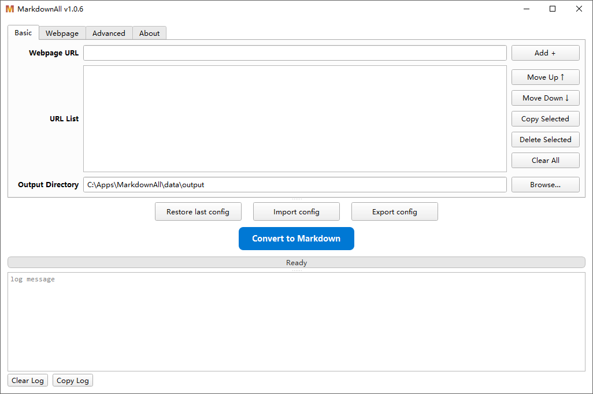

# MarkdownAll

MarkdownAll is a sophisticated desktop application designed to effortlessly convert web articles into clean, readable Markdown files. Built with a modular architecture and modern GUI framework, it's perfect for archiving content, creating a personal knowledge base.

## Screenshots




## Features

* **Modern & Intuitive GUI:** Clean and responsive graphical interface built with PySide6, featuring tabbed interface and splitter layout for optimal user experience.
* **Batch Conversion:** Convert multiple URLs in a single session with real-time progress tracking and status updates.
* **Advanced Crawler Technology:** Multi-strategy crawler system with Playwright, httpx, and Requests for handling complex websites with anti-detection measures and smart retry logic.
* **Specialized Site Handlers:** Dedicated processors for WeChat Official Account Articles, Zhihu.com, WordPress blogs, Next.js blogs, sspai.com, appinn.com, and intelligent Generic Handler for all other websites.
* **Comprehensive Options:** Proxy support, SSL verification bypass, local image downloading, content filtering, and Speed Mode with shared browser for improved performance.
* **Session Management:** Auto-save sessions, config export/import, and support for multiple named sessions for different projects.
* **Multilingual Support:** Built-in support for English and Chinese (Simplified) with automatic language detection and easy switching.
* **Structured Logging:** Comprehensive logging system with phase-aware progress tracking and conversion duration statistics.

## Installation

To set up the project locally, you will need a working Python environment (Python 3.10+ recommended).

1. **Clone the repository:**
   ```bash
   git clone https://github.com/VimWei/MarkdownAll
   ```
2. **Install Python venv:**
   ```bash
   # 2.1 Intasll uv
   ## Windows (PowerShell)
   powershell -ExecutionPolicy ByPass -c "irm https://astral.sh/uv/install.ps1 | iex"
   ## Linux/macOS
   curl -LsSf https://astral.sh/uv/install.sh | sh

   # 2.2 sync python environment
   cd MarkdownAll
   uv sync
   ```
3. **Install Playwright browsers:**
   ```bash
   playwright install
   ```

## Usage

### Launching the Application

Option 1: (Windows/Linux/macOS) Command line:
```bash
uv run markdownall
```
Option 2: (Windows only) Double-click launcher file `MarkdownAll.vbs`.

### Basic Usage

**Converting Articles:**
1. Add URLs to the list using the input field and "Add +" button
2. Set your output directory using "Browse…" 
3. Configure options in the "Webpage" tab (optional):
   * **Download Images:** Recommended for complete offline archives
   * **Speed Mode:** Enable for faster batch processing
   * **Proxy/SSL:** Configure if needed for your network environment
4. Click "Convert to Markdown" to start the process

**Tips:**
- Use up/down arrows to reorder URLs before conversion
- Enable "Filter Non-content Elements" for cleaner Generic Handler results
- Check the log panel for real-time conversion progress and status

## Acknowledgements

This project stands on the shoulders of giants. We would like to thank the developers of these outstanding open-source libraries:

* **MarkItDown:** For the core Markdown conversion engine that powers the entire application.
* **PySide6:** For the powerful and modern Qt-based GUI framework that provides the responsive user interface.
* **Playwright:** For modern browser automation and handling complex anti-bot scenarios on challenging websites.
* **httpx:** For high-performance HTTP/2 client capabilities and modern async support.
* **Requests:** For robust and simple HTTP requests with excellent session management.
* **BeautifulSoup4:** For its excellence in parsing and navigating HTML content.
* **lxml:** For fast and reliable XML/HTML parsing capabilities.
* **aiohttp:** For asynchronous HTTP client functionality enabling concurrent image downloads.

## License

This project is licensed under the **GNU General Public License v3.0 (GPL-3.0)**. 

This means:
- You are free to use, modify, and distribute this software
- Any derivative works must also be licensed under GPL-3.0
- You must make the source code available when distributing the software
- You must preserve copyright notices and license information

For more details, see the [LICENSE](LICENSE) file or visit [https://www.gnu.org/licenses/gpl-3.0.html](https://www.gnu.org/licenses/gpl-3.0.html).
